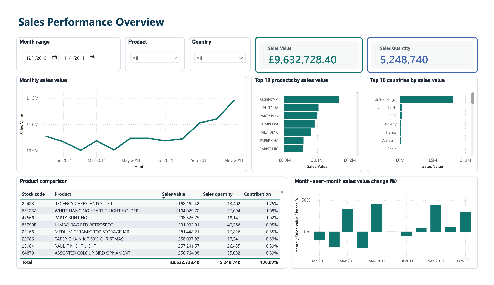

# Sales Performance Analysis

Case study nhỏ phân tích **Sales Performance** end-to-end bằng **SQL, DuckDB và Power BI**, tập trung xác định sản phẩm và quốc gia đóng góp lớn vào Sales Value, đồng thời theo dõi Sales Value theo tháng.

Nguồn dữ liệu: Chen, D. (2015), [Online Retail — UCI Machine Learning Repository](https://archive.ics.uci.edu/dataset/352/online%2Bretail), [DOI: 10.24432/C5BW33](https://doi.org/10.24432/C5BW33). Giấy phép: [CC BY 4.0](https://creativecommons.org/licenses/by/4.0/).

## Dashboard



Báo cáo một trang dashboard gồm bộ lọc Month range, Product và Country; hai KPI Sales Value và Sales Quantity; xu hướng sales value theo tháng; Top 10 sản phẩm và quốc gia; bảng so sánh sản phẩm; cùng biểu đồ month-over-month sales value change.

## Bài toán kinh doanh

UCI Online Retail chứa giao dịch thực của một nhà bán lẻ trực tuyến tại UK. Project chuyển dữ liệu giao dịch thành reporting model và dashboard phục vụ một commercial manager.

| Nội dung | Phạm vi |
|---|---|
| Câu hỏi chính | Sản phẩm và quốc gia nào đóng góp lớn vào Sales Value, và Sales Value thay đổi thế nào theo tháng? |
| Quyết định cần hỗ trợ | Xác định sản phẩm và quốc gia đóng góp lớn; chọn một sản phẩm để kiểm tra sâu và đề xuất bước xác minh thương mại |
| Kỳ báo cáo | Từ `2010-12-01` đến hết `2011-11-30` |
| Metric chính | Sales Value và Sales Quantity |
| Phạm vi diễn giải | Phân tích mô tả; không kết luận nguyên nhân khi chưa có bằng chứng |

## Kết quả chính

- Toàn kỳ ghi nhận **£9.63M Sales Value** và **5.25M Sales Quantity**, gồm **3,797 sản phẩm** tại **38 giá trị Country**. [SQL](sql/06_business_analysis.sql) · [Kết quả](outputs/evidence/57_analysis_overall_kpis.csv)
- **United Kingdom** đứng đầu với **£8.15M**, tương ứng **84.64% Sales Value** toàn kỳ. Đây là mức tập trung trong trường địa lý được ghi nhận, không phải thị phần. [Kết quả](outputs/evidence/59_analysis_country_ranking.csv)
- **`22423 · REGENCY CAKESTAND 3 TIER`** là sản phẩm đứng đầu theo Sales Value với **£168,162.42**, **13,402 units** và **1.75% đóng góp**. [Kết quả](outputs/evidence/58_analysis_product_ranking.csv)

## Case study: Sản phẩm ưu tiên

`22423 · REGENCY CAKESTAND 3 TIER` được chọn theo rule đã xác định trước: Sales Value cao nhất toàn kỳ, tie-break bằng `stock_code` tăng dần.

| Tín hiệu | Bằng chứng |
|---|---|
| Quy mô toàn kỳ | £168,162.42 Sales Value; 13,402 units; 1.75% đóng góp |
| Tính liên tục | Có accepted sales trong đủ 12 tháng của kỳ báo cáo |
| Tháng cao nhất | December 2010 với £27,694.76; đây là tháng đầu kỳ nên không có tháng lịch liền trước để so sánh |
| Mức tập trung | Năm invoice lớn nhất chiếm 33.25% Sales Value của sản phẩm trong tháng cao nhất |
| Điểm cần kiểm tra | Hai trong năm invoice trên thiếu `CustomerID` |

### Hành động đề xuất

Ưu tiên xác minh **order status, fulfilment, customer, unit price, quantity và product master** của các invoice giá trị lớn trước khi thay đổi pricing, inventory hoặc campaign.

### Giới hạn và hướng mở rộng

- Dataset có dữ liệu Cancellation, nhưng dự án không đưa các giao dịch này vào Sales Value nên chưa xác định giá trị bán thuần hoặc tỷ lệ hoàn/hủy.
- Đây là một dự án nhỏ nên tác giả không muốn đào sâu thêm các khía cạnh có thể khai thác khác như bổ sung thêm dữ liệu holiday từ bên ngoài, phân tích pattern theo ngày, tuần,...

## Phương pháp và pipeline

```text
CSV → DuckDB raw → Clean transactions → Accepted sales lines → Reporting CSV → Power BI model và DAX
```

Quy trình phân tích được chia thành các lớp có trách nhiệm rõ ràng:

1. **Raw:** giữ tám trường nguồn dạng text và `source_row_number` để truy vết.
2. **Clean:** chuyển kiểu, loại exact duplicate theo rule và giữ các dòng bất thường cùng quality flags.
3. **Accepted sales:** áp dụng business rules đã được xác nhận bằng audit; không coi mọi dòng clean là doanh số.
4. **Reporting model:** tổng hợp fact ở grain ngày × sản phẩm × quốc gia và tạo Product, Country, Date dimensions.
5. **Power BI:** nạp bốn reporting CSV, tính DAX measures và trình bày dashboard một trang.

## Mô hình báo cáo

| Dimension — one side | Fact — many side | Filter direction |
|---|---|---|
| `dim_date[calendar_date]` | `fact_sales[transaction_date]` | Dimension → fact |
| `dim_product[stock_code]` | `fact_sales[stock_code]` | Dimension → fact |
| `dim_country[country]` | `fact_sales[country]` | Dimension → fact |

Bốn file trong `outputs/reporting` là nguồn cho Power BI reporting model. `accepted_sales_lines` được giữ trong DuckDB để truy vết. Bảng clean đầy đủ được lưu riêng tại `outputs/cleaned`.

## Cấu trúc repository

```text
Data Analyst Portfolio/
├── AGENTS.md
├── README.md
├── .gitignore
├── docs/
│   └── project-notes.md
├── data/
│   ├── raw/
│   │   └── online_retail.csv     # dữ liệu đầu vào
│   └── local/
│       └── analytics.duckdb      # raw, clean và reporting model
├── sql/
│   ├── 01_data_audit.sql
│   ├── 02_clean_transactions.sql
│   ├── 03_business_audit.sql
│   ├── 04_reporting_model.sql
│   ├── 05_validate_metrics_model.sql
│   └── 06_business_analysis.sql
├── outputs/
│   ├── evidence/                 # audit, validation và analysis results
│   ├── cleaned/                  # clean transaction lines
│   ├── reporting/                # Power BI input tables
│   └── previews/                 # dashboard image
└── powerbi/
    └── SalesPerformance.pbix     # file báo cáo Power BI
```

<details>
<summary><strong>Ánh xạ đầy đủ SQL result → export file</strong></summary>

| Kết quả | Vị trí export |
|---|---|
| Các query script 01 | File `01_`–`09_` hiện có trong `outputs/evidence` |
| Cast checks, raw schema, clean schema, row reconciliation, quality flags, clean validation của script 02, theo thứ tự này | File `10_`–`15_` hiện có trong `outputs/evidence` |
| Time coverage overview, monthly time coverage và dates without transactions của script 03 | File `16_`–`18_` hiện có trong `outputs/evidence` |
| Identifier format summary, other values, case collisions, StockCode case context, invoice consistency và timestamp pattern của script 03 | File `19_`–`24_` hiện có trong `outputs/evidence` |
| Sales eligibility summary và unusual line magnitudes của script 03 | [25_sales_eligibility_summary.csv](outputs/evidence/25_sales_eligibility_summary.csv), [26_unusual_line_magnitudes.csv](outputs/evidence/26_unusual_line_magnitudes.csv) |
| Nonstandard sales candidates, StockCode–Description audits, label checks và missing-description check của script 03 | File [27_](outputs/evidence/27_nonstandard_sales_candidate_codes.csv)–[34_](outputs/evidence/34_sales_candidate_codes_without_description.csv) hiện có trong `outputs/evidence` |
| Possible non-merchandise candidates và Manual-code context của script 03 | [35_possible_non_merchandise_sales_candidates.csv](outputs/evidence/35_possible_non_merchandise_sales_candidates.csv), [36_manual_code_context.csv](outputs/evidence/36_manual_code_context.csv) |
| Sales population decision summary của script 03 | [37_sales_population_decision_summary.csv](outputs/evidence/37_sales_population_decision_summary.csv) |
| Country dimension candidates của script 03 | [38_country_dimension_candidates.csv](outputs/evidence/38_country_dimension_candidates.csv) |
| Accepted sales schema và validation của script 04 | [39_accepted_sales_table_schema.csv](outputs/evidence/39_accepted_sales_table_schema.csv), [40_accepted_sales_validation.csv](outputs/evidence/40_accepted_sales_validation.csv) |
| Fact sales schema và validation của script 04 | [41_fact_sales_table_schema.csv](outputs/evidence/41_fact_sales_table_schema.csv), [42_fact_sales_validation.csv](outputs/evidence/42_fact_sales_validation.csv) |
| Product dimension schema và validation của script 04 | [43_dim_product_table_schema.csv](outputs/evidence/43_dim_product_table_schema.csv), [44_dim_product_validation.csv](outputs/evidence/44_dim_product_validation.csv) |
| Country dimension schema và validation của script 04 | [45_dim_country_table_schema.csv](outputs/evidence/45_dim_country_table_schema.csv), [46_dim_country_validation.csv](outputs/evidence/46_dim_country_validation.csv) |
| Date dimension schema và validation của script 04 | [47_dim_date_table_schema.csv](outputs/evidence/47_dim_date_table_schema.csv), [48_dim_date_validation.csv](outputs/evidence/48_dim_date_validation.csv) |
| Tổng hợp validation reporting model của script 04 | [49_reporting_model_validation.csv](outputs/evidence/49_reporting_model_validation.csv) |
| Sales population reconciliation và accepted membership của script 05 | [50_sales_population_reconciliation.csv](outputs/evidence/50_sales_population_reconciliation.csv), [51_accepted_sales_membership.csv](outputs/evidence/51_accepted_sales_membership.csv) |
| Metric reconciliation theo total, date, product và country của script 05 | [52_metric_reconciliation.csv](outputs/evidence/52_metric_reconciliation.csv) |
| Grain, keys, coverage và joins của script 05 | [53_model_integrity_validation.csv](outputs/evidence/53_model_integrity_validation.csv) |
| Contribution denominator, selected scope và zero case của script 05 | [54_contribution_validation.csv](outputs/evidence/54_contribution_validation.csv) |
| Month sequence và monthly comparison logic của script 05 | [55_month_sequence_validation.csv](outputs/evidence/55_month_sequence_validation.csv), [56_monthly_comparison_logic_test.csv](outputs/evidence/56_monthly_comparison_logic_test.csv) |
| Overall KPIs, product/country rankings và monthly sales của script 06 | File [57_](outputs/evidence/57_analysis_overall_kpis.csv)–[60_](outputs/evidence/60_analysis_monthly_sales.csv) |
| Priority-product summary, monthly pattern, invoice concentration và top lines của script 06 | File [61_](outputs/evidence/61_analysis_priority_product_summary.csv)–[64_](outputs/evidence/64_analysis_priority_product_top_transactions.csv) |
| Query `clean_transactions` cuối script 02 | [outputs/cleaned/01_clean_transactions.csv](outputs/cleaned/01_clean_transactions.csv) |
| Query `fact_sales` của script 04 | [outputs/reporting/01_fact_sales.csv](outputs/reporting/01_fact_sales.csv) |
| Query `dim_product` của script 04 | [outputs/reporting/02_dim_product.csv](outputs/reporting/02_dim_product.csv) |
| Query `dim_country` của script 04 | [outputs/reporting/03_dim_country.csv](outputs/reporting/03_dim_country.csv) |
| Query `dim_date` của script 04 | [outputs/reporting/04_dim_date.csv](outputs/reporting/04_dim_date.csv) |

</details>
